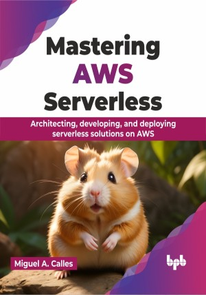

# Mastering AWS Serverless

Master the art of designing and creating serverless architectures and applications

This is the repository for [Mastering AWS Serverless
](https://bpbonline.com/products/mastering-aws-serverless?variant=43619081224392),published by BPB Publications.

## About the Book
Serverless computing is relatively new compared to server-based designs. Amazon Web Services launched its serverless computing offering by introducing AWS Lambda. Lambda has introduced a revolution in cloud computing, where servers could be excluded from architectures, and events could be used to trigger other resources. The AWS serverless services have allowed developers, startups, and large enterprises to focus more on developing and creating features and spend less time managing and securing servers.

It covers key concepts like serverless architecture and AWS services. You will learn to create event-driven apps, launch websites, and build APIs with hands-on exercises. The book will explore storage options and data processing, including serverless Machine Learning. Discover best practices for architecture, security, and cost optimization. The book will cover advanced topics like AWS SAM and Lambda layers for complex workflows. Finally, get guidance on creating new serverless apps and migrating existing ones.  

The knowledge gained from this book will help you create a serverless website, application programming interface, and backend. In addition, the information covered in the book will help you process and analyze data using a serverless design.

## What You Will Learn
• Creating a serverless website using Amazon S3 and CloudFront.

• Creating a serverless API using Amazon API Gateway.

• Create serverless functions with AWS Lambda.

• Save data using Amazon DynamoDB and Amazon S3.

• Perform authentication and authorization with Amazon Cognito.
